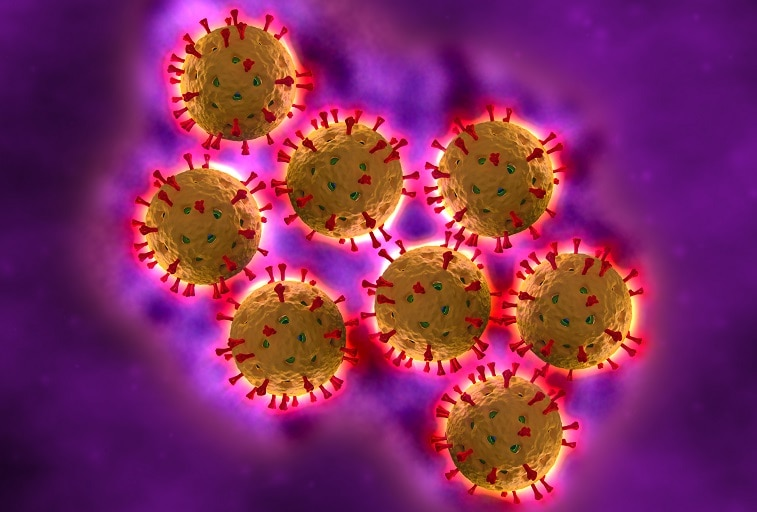
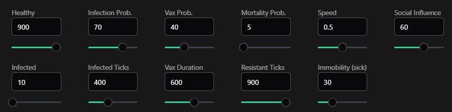

# Rotavirus Simulation System



## Table of Contents

- [Overview](#overview)
- [Features](#features)
- [Technical Architecture](#technical-architecture)
- [Simulation Parameters](#simulation-parameters)
- [Agent States](#agent-states)
- [Environment Design](#environment-design)
- [Data Visualization](#data-visualization)
- [Installation & Setup](#installation--setup)
- [Usage Guide](#usage-guide)
- [Implementation Details](#implementation-details)
- [Future Enhancements](#future-enhancements)

## Overview

This project simulates the propagation of rotavirus through a population using an Agent-Based Model (ABM). The simulation enables analysis of infection dynamics and evaluation of factors such as vaccination, immunity, and mortality rates.

A key innovation in this model is the social influence mechanism, where vaccinated agents can alert nearby healthy agents about infection risks, potentially influencing their decision to get vaccinated. This feature allows for studying how social factors affect health decision-making.

## Features

- **Advanced Agent-Based Modeling** - Realistic simulation of disease spread through agent interactions
- **Multiple Agent States** - Agents can transition between healthy, infected, vaccinated, resistant, or deceased
- **Environmental Constraints** - Movement restricted to road networks in a grid layout
- **Social Influence Dynamics** - Vaccinated agents can influence nearby healthy agents
- **Real-time Visualization** - Interactive charts tracking population metrics
- **Configurable Parameters** - Extensive customization of simulation variables
- **Responsive Design** - Built with Vue.js for a modern, responsive user interface

## Technical Architecture

The simulation leverages the combined power of AgentScript for the underlying ABM framework and Vue.js for the user interface. This architecture provides:

- **Separation of Concerns** - Simulation logic is decoupled from visualization
- **Reactive UI** - Real-time updates to simulation state are reflected in the interface
- **Performance Optimization** - Efficient agent processing and rendering

## Simulation Parameters

Users can adjust the following parameters to customize the simulation:

| Parameter               | Range   | Description                                                  |
| ----------------------- | ------- | ------------------------------------------------------------ |
| Healthy Population      | 0-1000  | Initial number of healthy agents                             |
| Initial Infected        | 0-1000  | Initial number of infected agents                            |
| Infection Probability   | 0-100%  | Likelihood of disease transmission during contact            |
| Infected Ticks          | 0-1000  | Duration an agent remains infected                           |
| Vaccination Probability | 0-100%  | Base probability of voluntary vaccination                    |
| Vaccination Duration    | 0-1000  | Period of immunity from vaccination                          |
| Mortality Probability   | 0-100%  | Chance of death while infected                               |
| Resistant Ticks         | 0-1000  | Duration an agent remains resistant after recovery           |
| Agent Speed             | 0.0-1.0 | Movement speed of agents                                     |
| Immobility Chance       | 0-100%  | Probability that infected agents become temporarily immobile |
| Social Influence        | 0-100%  | Strength of vaccinated agents' influence on others           |



## Agent States

The simulation incorporates five distinct agent states:

### Healthy Agents

- Move freely within the environment
- Susceptible to infection through proximity to infected agents
- Can choose to get vaccinated based on base probability or social influence

### Infected Agents

- Move at reduced speed (20% of normal)
- May become temporarily immobile
- Can transmit virus to nearby susceptible agents
- Either recover (becoming resistant) or die after infected ticks pass

### Resistant Agents

- Temporary immunity after recovering from infection
- Cannot be infected during resistance period
- Return to healthy state after resistant ticks expire

### Vaccinated Agents

- Temporary immunity from vaccination
- Can detect nearby infected agents
- Alert and influence nearby healthy agents to get vaccinated
- Return to healthy state after vaccination duration expires

### Deceased Agents

- Removed from the simulation
- Reduce the total population count

## Environment Design

The simulation environment is structured as a grid with designated road networks:

- **Road Network** - Agents move only along predefined road paths
- **Grid Layout** - Roads form a structured grid pattern

## Data Visualization

The simulation includes comprehensive data visualization tools:

- **Real-time Population Charts** - Track all agent categories dynamically
- **Customizable Plotting** - Toggle specific metrics on/off for clearer analysis
- **Population Tracking** - Monitor total population, healthy, infected, resistant, vaccinated, and deaths
- **Timeline Analysis** - Observe how populations change over simulation time

## Installation & Setup

Getting started with the simulation is straightforward:

```bash
# Clone the repository
git clone https://github.com/AndrsBarrer/Rotavirus-Simulation.git

# Navigate to project directory
cd Rotavirus-Simulation

# Install dependencies
npm install

# Launch development server
npm run dev
```

## Usage Guide

1. **Configure Parameters** - Adjust simulation settings using the control panel
2. **Start Simulation** - Click the start button to begin the simulation
3. **Monitor Results** - Observe population changes through real-time charts
4. **Analyze Outcomes** - Compare results across different parameter configurations

## Implementation Details

### Agent Sensing Mechanisms

- **Proximity Detection** - Agents detect others within a defined radius
- **Status Recognition** - Agents can determine the state of nearby agents
- **Risk Assessment** - Vaccinated agents evaluate infection risk in their vicinity

### Agent Action Systems

- **Movement Logic** - Healthy agents move at full speed, infected at 20% speed
- **State Transitions** - Probabilistic state changes based on interactions and timers
- **Social Influence** - Vaccinated agents can increase vaccination probability for nearby healthy agents

## Future Enhancements

Potential areas for expansion include:

- **Geographic Influence** - Implementing region-specific infection rates
- **Age Demographics** - Adding age-based vulnerability factors
- **Vaccination Campaigns** - Simulating targeted intervention strategies
- **Variant Evolution** - Modeling virus mutations over time
- **Hospital Capacity** - Adding healthcare system constraints

---

## About the Author

This simulation was developed by Andres Barrera Rodriguez as part of the Artificial Intelligence course at Universidad Autonoma de Baja California, under the guidance of Professor Mauricio Alonso Sanchez Herrera.

Vue.js played a crucial role in this implementation, enabling the creation of a reactive and component-based user interface that efficiently communicates with the underlying simulation model. The framework's reactivity system was particularly valuable for real-time data visualization, allowing seamless updates to charts and statistics as the simulation progresses without requiring page refreshes or manual data polling.

The development of this simulation represents an intersection of computer science, epidemiology, and social behavior modeling, demonstrating practical applications of artificial intelligence and modern web technologies in public health research.

---

_Last Updated: March 21, 2025_
